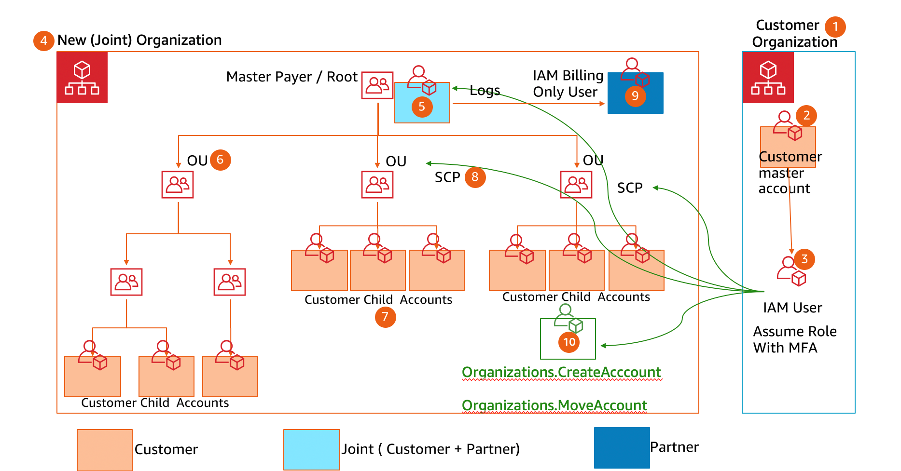

## A Cloud Guru
  
### 什么是 Organizations
提供跨账号（Account）管理，比如跨账号管理某个服务的相关 Policies（SCPs）。  
一个大的企业往往需要多个 AWS 账号，这些账号可能用于不同的环境、项目、业务单元（比如销售账号、开发者账号、支持账号等等）。  
Organizations 业务单元可以是嵌套的，即比如开发者账号单元下可以再创建一个测试账号单元（嵌套的单元的 policies 比其父单元的 policies 的优先级高），把账号转入某个单元时需要在 Organizations 控制台勾选该账号并选择 `Move`。  
Organizations 可以新建 SCPs 或复制已有 SCPs。  
Service Control Policies（SCPs）不能对主账号执行，即无法对主账号限制任何服务的权限，主账号无论如何都对所有 AWS 服务拥有权限。  
Organizations 还可以合并账单信息从而看到主账号及所有其从账号的账单，还可以为所有账号都设置同一个支付账户、方式，而且通过合并支付使用各类服务你可能还能得到服务合并使用相关折扣。  
一些 AWS 服务是可被信任以访问 Organizations 的信息的，比如 CloudTrail、Config 等等。  
  
AWS Organizations：  
* 程序式地创建新账号（因此可以自动化账号创建与管理）
* 创建、维护账号分组
* 为分组设置 policies  
  
Organizations 会覆盖账号内的 IAM 设置（比如 IAM 设置有 EC2 权限，Organizations 可以覆盖掉、取消 EC2 权限）  
为了设置 Organizations，会有一个账号被定义为主账号即拥有 Organizations 的权限，然后可以创建、增添从账号（对于已有账号可以通过邀请实现，该已有账号只需去往 AWS Organizations 的控制台可以看到该邀请，点击接受即可完成，在之后从账号仍然随时可以在 Organizations 控制台选择退出主账号的）。  
  
#### 示例服务控制策略（SCP）
* [Prevent users from deleting Amazon VPC flow logs](./prevent_deleting_vpc_flow_logs.json)  
* [Prevent any VPC that doesn't already have internet access from getting it](./prevent_private_vpc_accessing_internet.json)  

## Organization & OU & Account & SCP
  
Resource Access Manager could share resource cross OU (e.g. Transit Gateway).  
