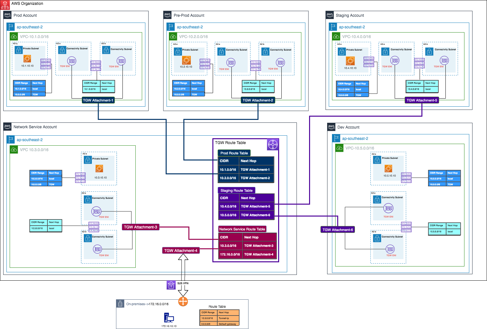

## CSAA Test Notes:  
* 5 VPC are allowed by default.
* Cannot enable peered VPC unless is in the same account, cannot tag a log, cannot change config.
* Not monitored: traffic to DNS, generate by Windows instance, traffic from metadata, DHCP traffic, traffic to reserved IP.
* Application load balancer must be deployed into at least two subnets.
* Not allow perform scan on VPC without alerting AWS.
* NAT gateway - automatically assigned public IP, scale up to 10 GB, not in SG (NAT instance is).
* VPC flow logs is stored in CloudWatch logs - VPC/Subnet/Network Interface levels.  
  
## A Cloud Guru
  
### 什么是 VPC
可以将其想象成一个在云上的虚拟数据中心。  
每次服务开通一个 EC2 实例时都需要设置一个 VPC，如不设置则会被分配到一个默认的 VPC，每个 region 都会有一个默认 VPC，每个 region 的默认 VPC 是你在 AWS 上开通账号时就自动给你配好、提供了。  
VPC 定义：AWS Virtual Private Cloud 让你开通一个 AWS 云的逻辑上独立且相互隔离的部分、区域，在这个部分、区域内你可以定义一个虚拟网络并在上面启动 AWS 资源，你对你的虚拟网络环境有着完全的控制：包括选择你的 IP 地址范围、创建子网、配置路由表与网关。你可以很容易地为 VPC 自定义网络配置，比如你可以为需要连接互联网的服务器创建一个面向公共的子网，然后把后端系统、数据库、应用服务们放在私有子网以规避互联网访问，另外 VPC 还提供了多层次安全的应用 - 包括安全组和网络 ACL 来帮助控制、管理、限制每个子网的 AWS EC2 实例的访问。  
你还可以创建硬件、物理层面的 VPN 连接你的已有数据中心到 VPC 上，从而达到通过 AWS 云扩展你的数据中心的目的。  
  
.png)  
（注意上图的 SN 即代表子网 subnet）一个子网总是等于一个 AZ，安全组可以扩展子网（比如 Bastion Host / Jumpbox），一个 region 可以有多个 VPC（默认限制 5 个，但可以发邮件向 AWS 额外申请该 region 的更多 VPC 的额度）。  
右上方显示的是 AWS 内置允许你使用的几类内部 IP 地址（[私有地址](https://github.com/yihaoye/stem-notes/blob/master/e-computer-network/computer_networks_101.md#%E7%A7%81%E6%9C%89%E5%9C%B0%E5%9D%80)）范围：  
* 10.0.0.0 - 10.255.255.255（10/8 prefix）
* 172.16.0.0 - 172.32.255.255（172.16/12 prefix）
* 192.168.0.0 - 192.168.255.255（192.168/16 prefix）  
以上是关于 CIDR 的（推荐工具网站：http://cidr.xyz/ ），prefix 越多说明范围越小比如 192.168 只有 16（32减16）位（即 2^16 个 IP 地址）供分配而 172.16 则有 20（32减12）位（即 2^32 个 IP 地址）供分配，AWS 允许 prefix 最大值为 28。  
  
默认情况下，Amazon EC2 和 Amazon VPC 使用 IPv4 寻址协议。创建 VPC 时，必须为其分配 IPv4 CIDR 块 (一系列私有 IPv4 地址)。私有 IPv4 地址无法通过 Internet 访问。要通过 Internet 连接你的实例或实现实例与其他具有公共终端节点的 AWS 服务之间的通信，你可以向实例分配全球唯一的公有 IPv4 地址。  
你可以选择向 VPC 和子网关联 IPv6 CIDR 块，然后将此块中的 IPv6 地址分配给 VPC 中的资源。IPv6 地址是公有的，可通过 Internet 访问。  
  
**私有 IPv4 地址**  
私有 IPv4 地址 (也称作私有 IP 地址) 无法通过 Internet 访问，但可用于 VPC 中实例之间的通信。当在 VPC 中启动实例时，系统会将子网地址范围中的一个主要私有 IPv4 地址分配给该实例的默认网络接口 (eth0)。另外，还为每个实例指定一个可解析为实例私有 IP 地址的私有 (内部) DNS 主机名。如果未指定主要私有 IP 地址，会在子网范围内为你选择可用的 IP 地址。  
  
**公有 IPv4 地址**  
所有子网都有一个用于确定在子网中创建的网络接口是否自动接收公有 IPv4 地址 (在本主题中也称作公有 IP 地址) 的属性。因此，当在启用了此属性的子网中启动实例时，系统会向为此实例创建的主网络接口 (eth0) 分配一个公有 IP 地址。公有 IP 地址通过网络地址转换 (NAT) 映射到主要私有 IP 地址。  
如果需要向账户分配一个永久公有 IP 地址，需要改为使用弹性 IP 地址。  
  
**IPv6 地址**  
IPv6 地址具有全局唯一性，因此可通过 Internet 访问。  
  
### 你可以用 VPC 做什么
VPC 基本上可以说是你的云上的一个虚拟数据中心，你可以通过 VPC 创建子网，每个子网被放进、连入不同的 AZ，子网可以有不同网络地址（比如 10.0.1.0）。  
另外还可以：  
* 选择子网启动实例
* 在每个子网内分配自定义 IP 地址范围
* 配置子网间的路由表（路由表将告知，该 VPC 内哪个子网可以连接哪个子网，以及具体地阻止某个子网连接另外某一个子网）
* 创建互联网网关（Internet Gateway）并附着其到该 VPC 上，每个 VPC 只能有一个互联网网关（互联网网关是高可用的并跨 AZ 的，一个 AZ 出现了 outage 并不会影响另一个 AZ 的互联网网关）
* 对你的 AWS 资源进行更好的安全控制（比如你可以通过使用子网的网络 ACL 来屏蔽来自某个 IP 地址的流量、将实例放入私有子网以防止外部访问）
* 实例的安全组（安全组可以扩展 AZ，安全组可以跨 AZ 因此安全组可以扩展多个子网）
* 子网网络 ACL  
  
### 默认 VPC 对比自定义 VPC
* 默认 VPC 对使用者更易用、友好，可以让你更易更快部署实例、资源
* 默认 VPC 的所有子网都是互联网可访问的（比如在日本部署一个实例，默认的每个 AZ 亦即子网都是互联网可访问的），默认 VPC 没有私有子网，因此你需要自己设置私有子网
* 默认 VPC 里每个 EC2 实例都有一个公共的 IP 地址以及一个私有的 IP 地址，在自定义 VPC 且私有子网里实例则只有私有 IP 地址  
  
你的默认 VPC 包含一个 Internet 网关，而且每个默认子网都是一个公有子网。在默认子网中启动的每个实例都有一个私有 IPv4 地址和一个公有 IPv4 地址。这些实例可以通过 Internet 网关与 Internet 通信。通过 Internet 网关，你的实例可通过 Amazon EC2 网络边界（network border）连接到 Internet。  
  
### VPC Peering
若不同 VPC 内的资源需要连接、沟通时，可以进行 VPC Peering：  
* 允许你通过一个 direct network route 及使用私有 IP 地址来连接一个 VPC 到另一个 VPC
* 由此，不同的 VPC 的子网内的实例们合作、沟通表现得就如同它们在同一个私有网络内一样
* 你还可以 Peering 另一个 AWS 账号的 VPC
* Peering 是在一种星型配置：即 1 个中心 VPC peer 其余 4 个，这意味着不存在 transitive（传递）peer，即在没有一对一明确配置的情况下其余的 VPC 不能推导地因为都 peer 中心 VPC 从而互相 peer  
  
### 其他
安全组（Security Groups）是 Stateful 的，这意味着总会同时允许 inbound outbound 流量（要不就同时不允许）。  
网络（Network）ACL 是 Stateless 的，即允许 inbound 不代表允许 outbound，反之也一样。  
  
### Lab
1. VPC 控制台 -> 创建 VPC（设置 IPv4 CIDR 块 - 比如 10.0.0.0/16）（还可以设置 IPv6 CIDR 块）
2. 一个默认路由表、一个默认安全组和一个默认网络 ACL 会被自动创建，子网和互联网网关需自己手动创建
3. 创建该 VPC 的子网，设置子网的 IPv4 CIDR 块（需属于该 VPC 剩余可用 IPv4 CIDR 块范围 - 比如 10.0.1.0/24，此例中你将会实际获得 251 个可用 IP 地址而不是 256 个，这是因为每个子网的 CIDR 块的最前 4 个以及最后 1 个 IP 地址默认已被占用，具体请看：https://docs.aws.amazon.com/zh_cn/vpc/latest/userguide/VPC_Subnets.html#VPC_Sizing ）（还可以设置 IPv6 CIDR 块），选择其 AZ（PS：不同 AWS 账号的 AZ 子选项不一定物理地址一样，因为 AWS 会打乱物理数据中心与 AZ 子名的映射顺序以保证均匀分配，因此某人的 us-east-1a 可能物理上等于另一个人的 us-east-1f）
4. 创建互联网网关，并附着其到已有的且未配置有互联网网关的 VPC 上
5. 此例 VPC 的默认路由表（又称主路由表）的默认路由目的地为 10.0.0.0/16、目标为 local，即本例 VPC 下的所有子网均可互相访问，如果新建子网且没有显式地为其关联一个独立的路由表，则该子网会默认关联到主路由表中。因为想让其中一个子网与互联网连接但又不想把主路由表设为互联网可访问（其他关联的或新添加的子网都会互联网可访问），因此需要为该子网新建一个路由表 - 创建路由表时选择归属的 VPC、通过设置目的地为 0.0.0.0/0 以及目标为互联网网关从而设置路由表为互联网可连接（除了 IPv4 也要记得设置 IPv6）、关联想要关联的子网到该路由表，到此该子网就可以连接互联网了。
6. 每个子网各自创建一个实例，测试可得互联网可访问的子网内的实例可通过浏览器访问，另一个子网内的实例则不可访问（注：可以设置新建的 VPC 自动分配 IP，可以让你更方便地通过浏览器访问子网及其实例，主默认 VPC 是默认自动分配 IP 的，但是自定义创建的 VPC 不是默认设为自动分配 IP 的）。创建实例时要新建或选择已有安全组，选择已有安全组时不能选择非本 VPC 的安全组，因为安全组不能跨多个 VPC。
7. 创建或更新安全组时，可以为其添加 Rule，包括配置应用层协议（如 HTTP、SSH）、传输层协议（如 TCP）、端口范围、请求来源与发送目的地（范围限制）（CIDR 形式表达）、Rule 描述。
8. 创建一个新的安全组，添加 MySQL、SSH、HTTPS 等应用层协议以及 TCP 协议，允许请求来源设置为那个公开的子网的 CIDR，则因此公开的子网内的应用就可以访问该安全组内的应用，且尽管新安全组的子网没有连接互联网网关，但此例中仍可以通过公开子网的实例 SSH 进新安全组内的实例。最后可以把已有的实例迁移、换到这个新安全组里。  
PS：以上未设置网络 ACL，因此两个子网共用一个默认的网络 ACL。  
  
### 关于子网
一个子网是私有还是公开，取决于其路由表是否设置目标为互联网网关或者目标是否间接与互联网相连比如同一个 VPC 内另一个公开子网的 NAT Gateway（若子网所在的 VPC 没有互联网网关或与互联网间接连接的网关、目标则该 VPC 内的子网只能是私有子网）（当然安全组与网络 ACL 理论上也可以通过阻止互联网协议或流量从而隔断互联网连接，但这不是它们的正确使用方法，它们更多是用于更具体的网络设置），子网本身没有私有与否的相关属性。  
  
### NAT Instance
NAT Instance 准备被 NAT Gateway 替代（https://docs.aws.amazon.com/zh_cn/vpc/latest/userguide/vpc-nat-comparison.html ）。  
通过使用你 VPC 中公有子网内的网络地址转换 (NAT) 实例，可让私有子网中的实例发起到 Internet 或其他 AWS 服务的出站 IPv4 流量（比如下载安装软件），但阻止这些实例接收由 Internet 上的用户发起的入站流量。另：NAT 不支持 IPv6 流量。  
可通过社区 AMI 启动、开通一个 NAT 实例，记得启动时为其配置一个公开的子网，及支持 HTTP/HTTPS 的安全组，然后为其 disable source/destination check（因为 NAT 只是代理），然后私有子网的路由表 outbound 添加该 NAT 实例为目标且 IP 范围为互联网 IP（CIDR 表示即可）。  
NAT Gateway 相比 NAT 实例更好处理单点故障问题更高可用等等。  
  
### Security Group 安全组
安全组充当虚拟防火墙，为其关联的实例控制数据流。要使用安全组，你可以添加入站规则以控制进入实例的传入流量，添加出站规则以控制来自你的实例的传出流量。要将安全组与实例关联，你可以在启动实例时指定安全组。无论你是添加还是删除安全组规则，我们都会将这些变化自动应用到与安全组相关的实例中。  
  
**安全组规则**  
下表介绍了安全组的入站和出站规则。你将自行添加入站规则。出站规则是默认规则，它允许发送到任何地址的出站通信 — 你无需自行添加此规则。  
  
  
### Network ACL (NACL)
全称：网络访问控制列表 (ACL) 。  
一个网络 ACL 只能属于一个 VPC，不能跨 VPC。  
VPC 的主默认网络 ACL 默认允许所有的 inbound 和 outbound 流量，自定义创建的网络 ACL，默认是阻止所有的 inbound 和 outbound 流量直到你添加自定义 Rules。  
VPC 的每个子网都必须关联一个网络 ACL，如果你不显式地关联子网到某个网络 ACL，则该子网会自动关联到默认的网络 ACL。  
你可以关联多个子网到同一个网络 ACL，但一个子网只能关联一个网络 ACL，一旦关联子网到另一个网络 ACL 则该子网的之前的关联就会取消。  
网络 ACL 包括一组 Rules，且从较小数字按序评估。  
网络 ACL 的 Rule 数字大小代表优先度，数字越小优先度越高。  
Rule 数字：AWS 建议数字从 100 开始，且 100 是给 IPv4 而 101 是给 IPv6，其他普通情况下建议新增的每个 Rule 最好按 100 递增。  
网络 ACL 添加 Rule 时与安全组添加 Rule 部分类似，包括配置应用层协议（如 HTTP、SSH）、传输层协议（如 TCP）、端口范围、请求来源（inbound）/发送目的地（outbound）（CIDR 形式表达）。不同的是 ACL Rule 最后有一项 Allow/Deny 选择。    
网络 ACL 的 inbound 和 outbound 的 Rule 是分开设置的，每一方的 Rule 都可以对流量 allow 或者是 deny。  
网络 ACL 是 stateless 的（与安全组的 stateful 不同），比如对 allowed 的 inbound 流量的响应会受到相关 outbound rule 的影响的（反之亦然）。  
安全组无法屏蔽某个 IP 地址，但你可以通过网络 ACL 做到这点、甚至屏蔽一段 IP 范围。  
在架构上，网络 ACL 处在安全组之前面对流量，所以网络 ACL 如果进行屏蔽等操作则安全组即使允许了该类型、协议、来源的流量也无法接收到，因为流量先被网络 ACL 拦截了。  
PS：https://docs.aws.amazon.com/zh_cn/vpc/latest/userguide/vpc-network-acls.html#nacl-ephemeral-ports  
  
网络访问控制列表 (ACL) 是 VPC 的一个可选安全层，可用作防火墙来控制进出一个或多个子网的流量。可以设置网络 ACL，使其规则与你的安全组相似，以便为 VPC 添加额外安全层。  
  
### 安全组与网络 ACL 的区别
安全组：  
* 是 EC2（更确切地说是绑定 Network Interfaces ENIs）的防火墙
* Stateful（incoming 规则都会应用到同一个会话的 outgoing 流量，比如允许 80 端口监听接收则也会允许同一个会话的 80 端口响应输出，即使其设置规则阻止 80 端口输出）
  * Traffic generated in response to allowed traffic in one direction is allowed to flow in the opposite direction. This doesn’t mean that the response flow is allowed in itself, i.e. combination of source and destination port must correspond to a previously generated “allowed” traffic, otherwise, any such traffic will be blocked. More precisely, this last bit is what actually represents the “state” monitoring capability of the firewall.
* 支持 allow 规则，不支持 deny 规则（因为默认规则为全部 deny）
* 在决定是否允许数据流前评估所有规则
* 对于 inbound/ingress traffic，安全组是第二层 defense layer；对于 outbound/egress traffic，安全组是第一层 defense layer
* 一个实例可以有多个安全组
* 只有在启动实例的同时指定安全组、或稍后将安全组与实例关联的情况下，操作才会被应用到实例
  
NACL：  
* 是 VPC 子网的防火墙
* Stateless（incoming 规则与 outgoing 规则没有 Stateful 的关联关系）
* 支持 allow 和 deny 规则（default ACL 默认允许所有 inbound 和 outbound 流量，但是自定义的 ACL 默认不允许任何 inbound 和 outbound 流量）
* 在决定是否允许流量时，按顺序处理规则，从编号最低的规则开始
* 对于 inbound/ingress traffic，NACL 是第一层 defense layer；对于 outbound/egress traffic，NACL 是第二层 defense layer
* 一个子网只能有一个 NACL
* 自动应用于与之关联的子网中的所有实例（因此，如果安全组规则过于宽松，它提供额外的防御层）
  
下图展示了由安全组和网络 ACL 提供的安全层。例如，来自互联网网关的数据流会使用路由表中的路由，路由到合适的子网。与子网关联的网络 ACL 规则控制允许进入子网的数据流。与实例关联的安全组规则控制允许进入实例的数据流。  
  
  
**何时使用哪个**  
NACL 是 security layer 的 backup。  
AWS Docs 原话：  
安全组：如果你需要额外的 security layer，你可以创建一个 network ACL 并增添规则（rules）。  
网络 ACL（NACL）：你可以设置网络 ACL，使其规则与你的安全组相似，以便为你的 VPC 添加额外安全层。  
  
[Ref 1](https://medium.com/awesome-cloud/aws-difference-between-security-groups-and-network-acls-adc632ea29ae)  
[Ref 2](https://docs.aws.amazon.com/zh_cn/vpc/latest/userguide/VPC_Security.html)  

### VPC Endpoint
应用场景：比如私有子网内的实例想往 S3 存储数据，但是又不想走互联网（NAT Instance/Gateway），则一个可行的办法即走 AWS 内网即需使用 VPC Endpoint（Gateway 或 Interface 两种类型选择，且每个 Endpoint 选择只针对某个 AWS 服务比如 S3、EC2 等等，Interface 类型即 Elastic Network Interface）。  
添加 Endpoint 时需要设置其关联的 VPC 、该 Endpoint 将服务的子网对应的路由表（该路由表会为它自动添加一个新 Route）以及该 Endpoint 的 Policy。  
Elastic Network Interface（ENI）：https://docs.aws.amazon.com/zh_cn/AWSEC2/latest/UserGuide/using-eni.html  
  
### VPC Flow Logs
这是一个 VPC 特性，可以让你获取 VPC 网络框架里关于流量的所有信息，如请求来源的 IP 地址、请求动作等等，这些流量日志数据会通过 CloudWatch Logs 保存起来。在你创建启用一个 flow log 后，其相关数据可以在 CloudWatch Logs 里找到。  
可创建的 Flow logs 有 3 个层级：  
* VPC
* 子网
* Network Interface Level  
你在 VPC 的控制台里即可创建 Flow Log。另外你还可以设置把 Flow Log 的对应的 CloudWatch 的 Log Group 流向（Stream to） Lambda 或 Elastic Search Service 以开发更多自动化的程序、搜索、监控。  
一旦一个 flow log 被创建了，你不可以再更改其配置。你不可以为不属于你 AWS 账号的 VPC 启用 Flow Log，即使它被你的 VPC Peered 了也不行。  
以下 IP 流量不能被监控：  
* 实例联系 AWS DNS 服务的流量，但不包括第三方 DNS 服务
* Windows 实例激活 AWS Windows 许可证的流量
* 实例元数据源 169.254.169.254 的流量
* DHCP 流量
* VPC 路由表默认占用的 IP 地址的流量  
  
### VPC 清理删除工作
主要需要注意删除顺序，因为某些服务依赖另外一些服务，所以需要先删除这些服务否则被依赖服务无法删除。  
  
### CIDR 相关
需要熟悉如何通过 CIDR 计算出 Netmask、First IP、Last IP、可用 IP 数量等等。  
VPC 的子网的最大 size 是 /16，最小 size 是 /28。  
AWS 默认每个子网占用 5 个 IP 地址，所以比如题目考核某个子网需要 X 个 IP 可用，请问最小 CIDR 为多少时要记得把此情况考虑进去。  
[CIDR 详解](https://github.com/yihaoye/stem-notes/blob/master/e-computer-network/computer_networks_101.md#cidr)  
  
### Direct Connect Gateway
之前知道，自定义网络（如 on-primise）要快速、低延迟、独占地连接 AWS 时需要 Direct Connect Connection（物理），如果该自定义网络想相同地连接 AWS 其他几个 region 的网络时则无需再一一建立 Direct Connect Connection，只需 AWS 云平台上不同 region 上的 VPC 间使用 Direct Connect Gateway 即可，自定义网络可以通过 Direct Connect Connection 连接的 region 间接地连接到其他 region（通过它们之间的 Direct Connect Gateway）。  
  
## AWS 子网划分策略
当创建一个 VPC 时，需要指定它的 VPC CIDR。我们创建的是私有网络，所以  VPC CIDR 可以从私有地址里任意选择。但是如果是在设计一个大的组织的网络，那么就需要按需分配你的 VPC CIDR，这是因为在大型组织里，经常会遇到两个 VPC 需要不经过共有网络实现互联，这需要两个 VPC CIDR 没有冲突。  
假设现在有一个 A 类子网地址：10.0.0.0/16，这个地址前 16 位是网络部分，后 16 位是主机部分。如果不继续对这个子网进行子网划分的话那么这个网络可以容纳 2^16-2（65534）台主机。为了便于网络管理、减少 IP 地址浪费和减少网络广播风暴，需要继续进行子网划分。  
  
进入真实的项目情景中。通常情况下一个项目会用 3 个部署环境：  
* Dev（开发环境）
* Staging（类生产环境）
* Production（生产环境）
  
如果服务需要支持 Production 环境 Region 级别的 High Availability (高可用性)，比如需要同时部署在 Tokyo Region 和 Singapore Region 以提供高可用性，那么 Production 环境就包含了 Tokyo 和 Singapore 两 Region。为了实现环境之间的隔离，每个独立的环境都会创建独立的 VPC，对这个项目来说，需要创建 4 个 VPC：  
* Dev Singapore（开发环境）
* Staging Singapore（类生产环境）
* Production Tokyo（生产环境）
* Production Singapore（生产环境）
  
每个子网必须完全位于一个 Availability Zones (可用区)内，并且不能跨越区域。通常，在一个 VPC 中会创建 3 种类型的 VPC Subnet：  
* Public Subnet
* NAT Subnet
* Private Subnet
  
为了提供 High Availability (高可用性)，通常会把服务部署在多个 Availability Zones 上。  
  
**子网划分策略**  
一开始划分子网时，要考虑以后有其他的环境要创建怎么办？不能上来就把 VPC 的地址全部划分完。  
最好的办法就是按需划分网络，为了按需划分网络，得提前预估网络需要容纳多少台主机。  
如果的每个 VPC Subnet 网络需要容纳 100 台主机。通过计算：2^7 - 5 (VPC 预留) = 123 > 100，得知主机位需要 7 位就可以满足需求。主机部分 7 位，则网络部分 25 位。  
若每个 VPC 是由 6 个 VPC Subnet 组成，通过计算：2^3 = 8 > 6，所以 VPC CIDR 网络部分需 25 - 3 = 22 位，主机部分 10 位：  
| VPC CIDR                | 网络部分                          | 主机部分           |
| ----------------------- | -------------------------------- | ---------------- |
| Dev VPC                 | 00001010   00000000 000000       | 00 00000000      |
| Staging VPC             | 00001010   00000000 000001       | 00 00000000      |
| Production Singpore VPC | 00001010   00000000 000010       | 00 00000000      |
| Production Tokyo VPC    | 00001010   00000000 000011       | 00 00000000      |

将 10.0.0.0/16 划分成了 2^6 = 64 个 /22 的子网，即只使用了其中的 4 个 /22 的子网。  
  
**VPC Subnet CIDR 划分**  
Dev VPC Subnet CIDR  
现在再来将 Dev 环境 VPC CIDR 10.0.0.0/22 划分成 VPC Subnet CIDR:  
| VPC Subnet        | 网络部分                         | 主机部分        |
| ----------------- | --------------------------------| ------------- |
| Public Subnet A   | 00001010   00000000 00000000  0 | 0000000       |
| Public Subnet B   | 00001010   00000000 00000000  1 | 0000000       |
| NAT Subnet A      | 00001010   00000000 00000001  0 | 0000000       |
| NAT Subnet B      | 00001010   00000000 00000001  1 | 0000000       |
| Private Subnet A  | 00001010   00000000 00000010  0 | 0000000       |
| Private Subnet B  | 00001010   00000000 00000010  1 | 0000000       |
| 未使用             | 00001010   00000000 00000011  0 | 0000000       |
| 未使用             | 00001010   00000000 00000011  1 | 0000000       |

转换成 VPC Subnet CIDR:  
| VPC Subnet        | VPC Subnet CIDR    |
| ----------------- | ------------------ |
| Public Subnet A   | 10.0.0.0/25        |
| Public Subnet B   | 10.0.0.128/25      |
| NAT Subnet A      | 10.0.1.0/25        |
| NAT Subnet B      | 10.0.1.128/25      |
| Private Subnet A  | 10.0.2.0/25        |
| Private Subnet B  | 10.0.2.128/25      |
  
其他 VPC 策略基本一样。  
  
## AWS Site-to-Site VPN
有两种方法配置 Hybrid Cloud（AWS VPC 连接 on-premise 内网络）：  
* Virtual Private Gateway
* Transit Gateway

https://docs.aws.amazon.com/zh_cn/vpn/latest/s2svpn/SetUpVPNConnections.html  

其中 Transit Gateway 更新更先进方便，可以通过 AWS RAM 共享给其他 AWS 账号，有助于构建更精简的网络架构。  
https://www.youtube.com/watch?v=4knN0B3_R_M  
  

https://aws.amazon.com/cn/blogs/architecture/field-notes-working-with-route-tables-in-aws-transit-gateway/  
  

Centralized egress to internet：  
https://docs.aws.amazon.com/whitepapers/latest/building-scalable-secure-multi-vpc-network-infrastructure/centralized-egress-to-internet.html  
https://www.youtube.com/watch?v=eG2zrqj0cRI  
https://docs.aviatrix.com/HowTos/tgw_egress_vpc.html  
  
## 本地网络集成云的 DNS 解决方案
https://docs.aws.amazon.com/zh_cn/prescriptive-guidance/latest/patterns/set-up-integrated-dns-resolution-for-hybrid-networks-in-amazon-route-53.html  
  
https://docs.aws.amazon.com/zh_cn/Route53/latest/DeveloperGuide/resolver-forwarding-outbound-queries.html  
  
  
Rule 依赖于 Outbound Endpoint，对于中心化的网络架构，比如有一个 AWS Account 托管中心 VPC 和中心 TGW，Rule 和 Outbound Endpoint 可以放在中心 VPC 里（也在这里创建），然后通过 RAM 把 Rule 共享给其他 AWS Account 以 associate 到其 VPC。  
  
## 参考
[AWS 子网划分策略](https://zhuanlan.zhihu.com/p/60952066)  
[AWS 使用教程 Amazon VPC](https://blog.csdn.net/zhuyunier/article/details/86593197)  
