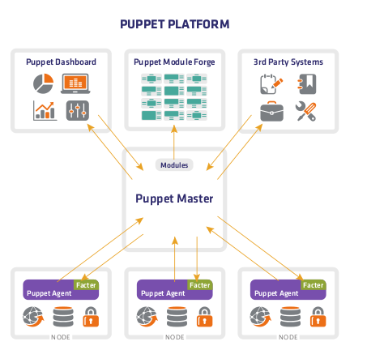

https://www.infoq.cn/article/introduction-puppet  
https://www.zsythink.net/archives/185  

比如你想给 100 台服务器安装、补丁、配置或更新软件、操作系统，又或者创建同一类用户时，不可能手动一个个服务器配置或执行脚本，Puppet 就是这种批量执行脚本或配置的自动化运维工具。  
在 Puppet 服务端进行配置管理，通过服务端，将管理员的“配置”传送到客户端，客户端再将管理员的“配置”落实到服务器（或说结点）上，正常情况是在要被配置的服务器、结点上安装、运行一个 Puppet 客户端。  
